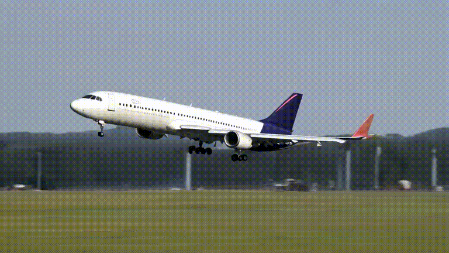
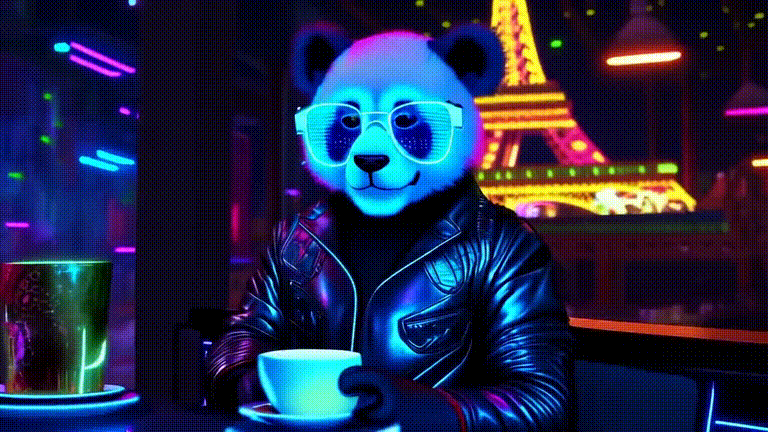
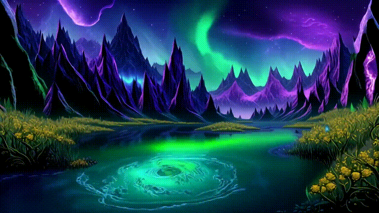
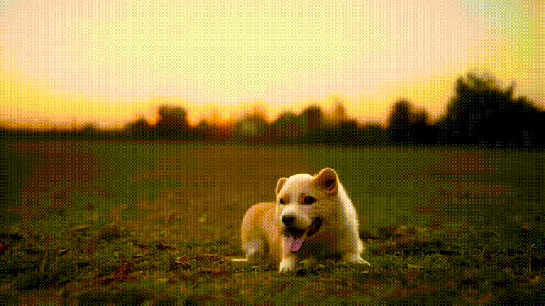
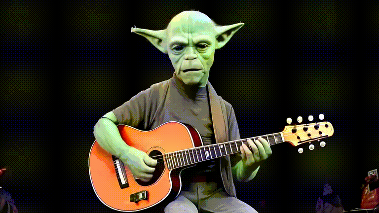
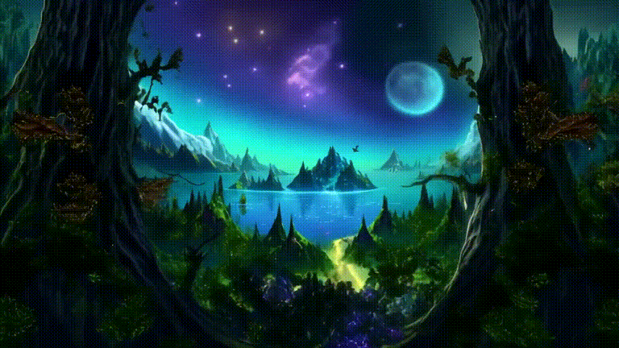

<table class="center">
  <!-- 第一行：两个 .gif -->
  <tr>
    <td></td>
    <td></td>
  </tr>
  <tr>
    <td>a green bird.</td>
    <td>an airplane taking off.</td>
  </tr>

  <!-- 第二行：一个大的 .gif -->
  <tr>
    <td colspan="2"></td>
  </tr>
  <tr>
    <td colspan="2">In a neon-lit Parisian café, a panda, dressed in a sleek, futuristic leather jacket with glowing blue accents, sits at a high-tech table. The café's interior is adorned with holographic art and vibrant, pulsating lights, casting a surreal glow. The panda, with cybernetic enhancements visible on its fur, lifts a steaming cup of coffee, the steam swirling with iridescent colors. Outside the window, the Eiffel Tower is illuminated with neon lights, blending the classic Parisian skyline with a cyberpunk aesthetic. The panda's reflective sunglasses catch the café's neon hues, creating a mesmerizing, otherworldly scene.</td>
  </tr>

  <!-- 第三行：两个 .gif -->
  <tr>
    <td></td>
    <td></td>
  </tr>
  <tr>
    <td>a horse bending down to drink water from a river.</td>
    <td>A tropical beach at sunrise, with palm trees and crystal-clear water in the foreground.</td>
  </tr>

  <!-- 第四行：一个大的 .gif -->
  <tr>
    <td colspan="2"></td>
  </tr>
  <tr>
    <td colspan="2">In a breathtaking fantasy landscape, towering crystal mountains shimmer under a sky painted with swirling auroras of green and purple. A serene, emerald lake reflects the vibrant colors, while bioluminescent plants and flowers glow softly along its shores. Majestic, winged creatures soar gracefully above, their feathers glinting in the ethereal light. Ancient, twisted trees with golden leaves line a cobblestone path that winds through the scene, leading to a grand, floating castle in the distance, its spires reaching towards the heavens. The air is filled with the gentle hum of magic, creating an atmosphere of wonder and enchantment.</td>
  </tr>

  <!-- 第五行：两个 .gif -->
  <tr>
    <td></td>
    <td></td>
  </tr>
  <tr>
    <td>a dog playing in park.</td>
    <td>Yoda playing guitar on the stage.</td>
  </tr>

  <!-- 第六行：一个大的 .gif -->
  <tr>
    <td colspan="2"></td>
  </tr>
  <tr>
    <td colspan="2">Soaring through a breathtaking fantasy realm, the journey begins over lush, emerald forests with towering, ancient trees whose leaves shimmer with a golden hue. The scene transitions to a majestic mountain range, where snow-capped peaks pierce the sky, and mystical creatures like dragons and griffins glide gracefully alongside. Next, the flight sweeps over a vast, crystalline lake, its waters reflecting a sky filled with vibrant, swirling auroras. The adventure continues through a sprawling, enchanted city with towering spires and glowing, floating islands, where magical beings roam the streets. Finally, the journey concludes in a serene, otherworldly meadow, bathed in the soft light of twin moons, with bioluminescent flowers illuminating the landscape in a mesmerizing dance of colors.</td>
  </tr>
</table>
